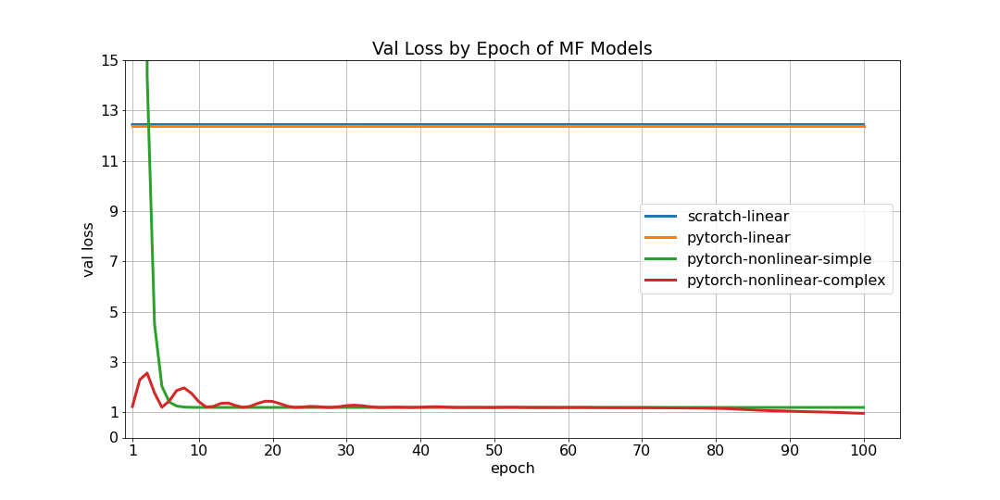
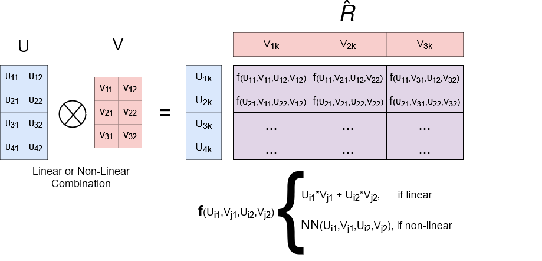
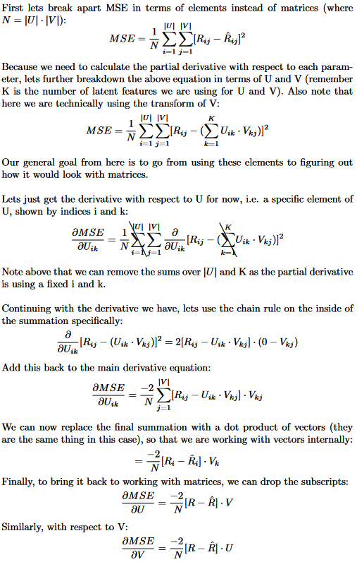
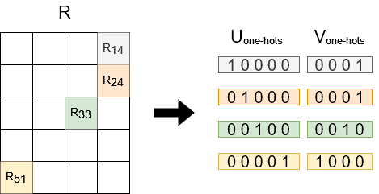
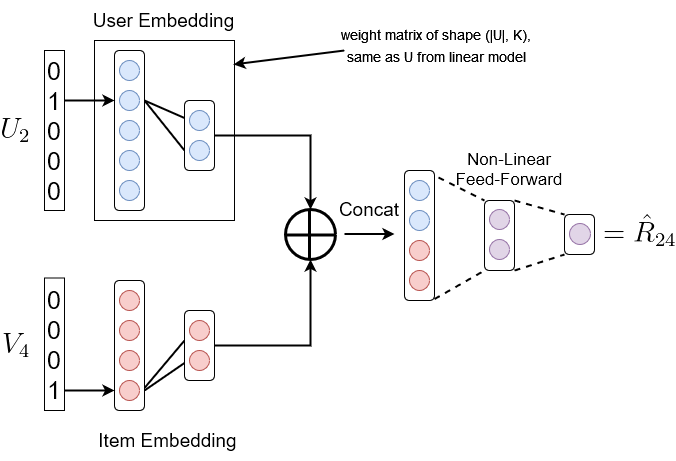

# Matrix Factorization for Collaborative Filtering: Linear to Non-Linear Models in Python

Accompanying repo for [this article](https://medium.com/@maxbrenner110/matrix-factorization-for-collaborative-filtering-linear-to-non-linear-models-in-python-5cf54363a03c). Code is found in [matrix_factorization.ipynb](matrix_factorization.ipynb) and [ratings.csv](ratings.csv) contains the ratings for the [MovieLens 100K dataset](https://grouplens.org/datasets/movielens/100k/).

## Running the Code

Make sure to have at least Python3.8 (might be fine with an older version of Python3). Dependencies listed in [requirements.txt](requirements.txt).

Run through [matrix_factorization.ipynb](matrix_factorization.ipynb); many comments included to help. Follow the article linked above to understand it in better detail.

## Example MovieLens Performance

## Other Article Images

